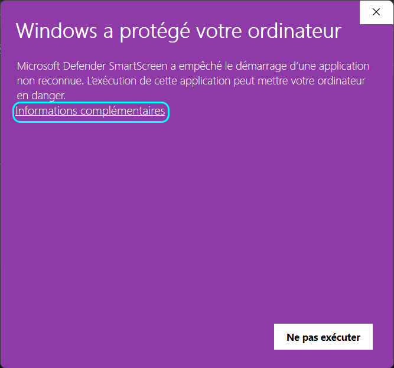
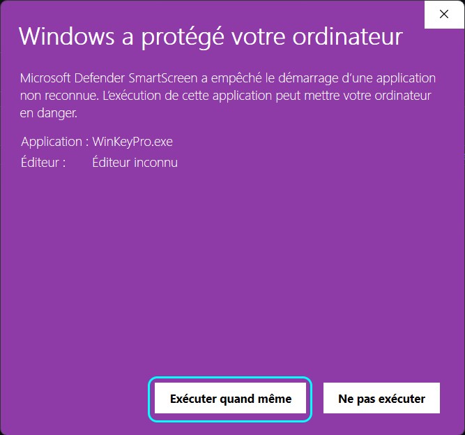
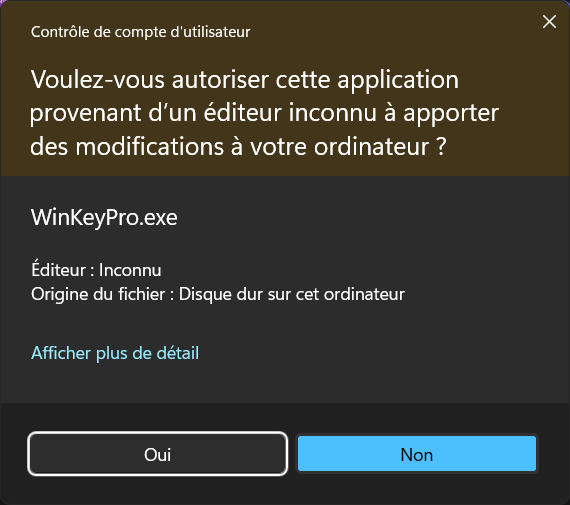

<h1 align="center">
<br>
<a href="https://github.com/StarKev"></a>
<br>
WinKeyPro
<br>
</h1>

[English](#english) | [Français](#français)

---

# English  

## Script Description  
**WinKeyPro** is a script designed to activate Windows 10 and 11 for free. It provides several options, including activation with a custom license key, license removal, and activation status verification.  

## Features  
- Activate Windows 10/11  
- Activation using a Windows product key  
- Uninstall the Windows license  
- Check Windows activation status  

## Script Execution  
1. Download the script to your machine.  
2. Open a terminal (Command Prompt or PowerShell) and navigate to the script's directory.  
3. Run the script by executing:  
   ```batch
   WinKeyPro.bat
   ```  

## First Execution Warning  
On the first run, Windows may display a security warning because the script comes from an unknown publisher. This is normal and expected.  

### 🔹 How to Proceed  
1. A warning screen will appear. Click **"More info"**.  

     

2. Click **"Run anyway"** to proceed.  

     

3. Confirm by clicking **"Yes"** when prompted for administrator privileges.  

     

ℹ️ **Note:** This warning will appear every time you execute the script unless it is signed with a trusted certificate.  

## Disclaimer  
This script is provided for **educational purposes only**. The user is responsible for how they use it.  

## Author  

| [](https://github.com/StarKev) |
| ---------------------------------------------------------------------------------------- |
| [Star Kev](https://github.com/StarKev)                                               |  

#

# Français  

## Description du script  
**WinKeyPro** est un script permettant d’activer Windows 10 et 11 gratuitement. Il propose plusieurs options, dont l’activation via une clé de licence personnalisée, la suppression de la licence existante et la vérification de l’état d’activation.  

## Fonctions  
- Activer Windows 10/11  
- Activation à l’aide d’une clé Windows  
- Désinstallation de la licence Windows  
- Vérifier l’état d’activation de Windows  

## Exécution du script / executable  
1. Téléchargez l’archive contenant le script et extrayez son contenu. 
2. Ouvrez le dossier extrait et double-cliquez sur WinKeyPro.exe.

## Avertissement à la première exécution  
Lors de la première exécution, Windows affichera un avertissement indiquant que l’éditeur est inconnu. Ceci est normal.  

### 🔹 Comment procéder  
1. Une fenêtre d’alerte s’affichera. Cliquez sur **"Informations complémentaires"**.  

     

2. Ensuite, cliquez sur **"Exécuter quand même"**.  

     

3. Enfin, validez en cliquant sur **"Oui"** lorsque Windows vous demande l’autorisation d’apporter des modifications au système.  

     

ℹ️ **Remarque :** Cette alerte apparaîtra à chaque exécution du script tant qu’il n’est pas signé numériquement.  

## Avertissement  
Ce projet est fourni **à des fins éducatives uniquement**. L’utilisateur est responsable de l’usage qu’il en fait.  

## Auteur  

| [](https://github.com/StarKev) |
| ---------------------------------------------------------------------------------------- |
| [Star Kev](https://github.com/StarKev)                                               |  

## Licence  

```text
Copyright (C) 2023-2025 StarKev

Licensed under the CC BY-NC-SA 4.0 (the "License");
you may not use this file except in compliance with the License.
You may obtain a copy of the License at

    https://creativecommons.org/licenses/by-nc-sa/4.0/

Unless required by applicable law or agreed to in writing, software
distributed under the License is distributed on an "AS IS" BASIS,
WITHOUT WARRANTIES OR CONDITIONS OF ANY KIND, either express or implied.
See the License for the specific language governing permissions and
limitations under the License.
```
